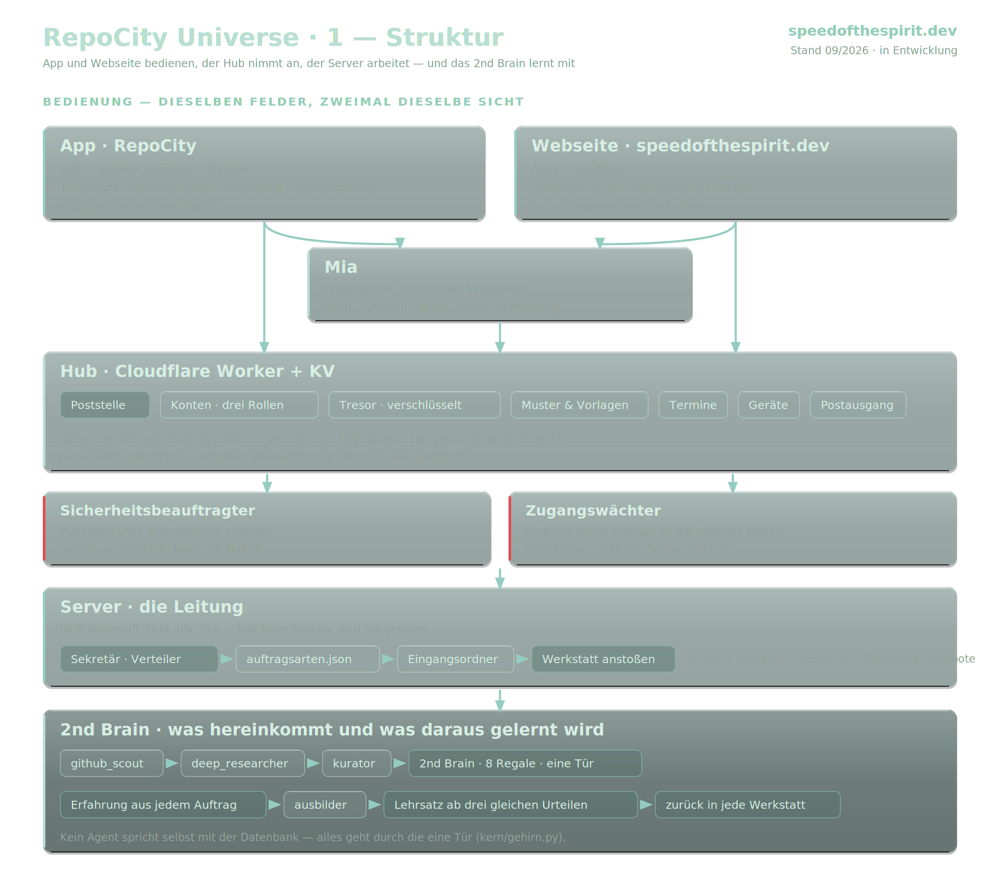
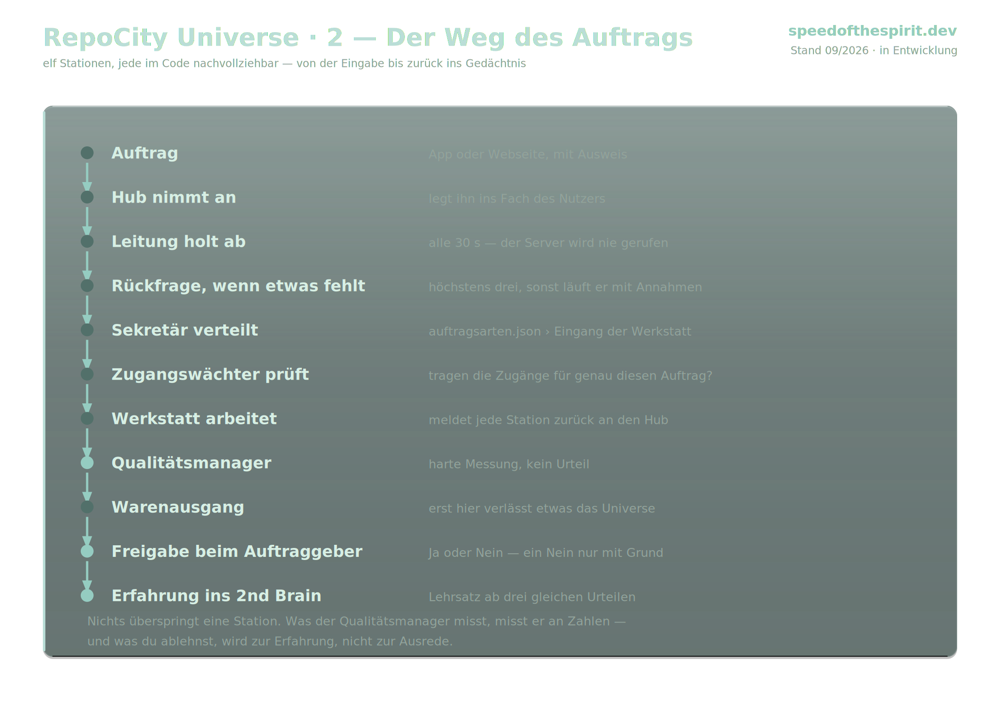
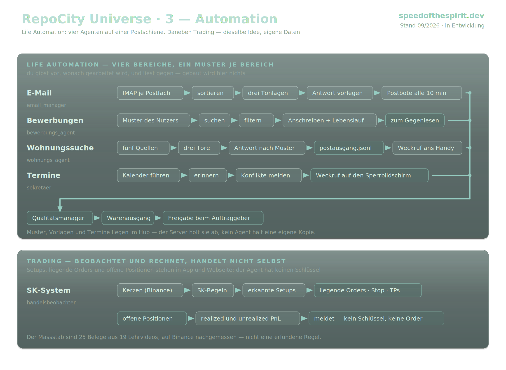
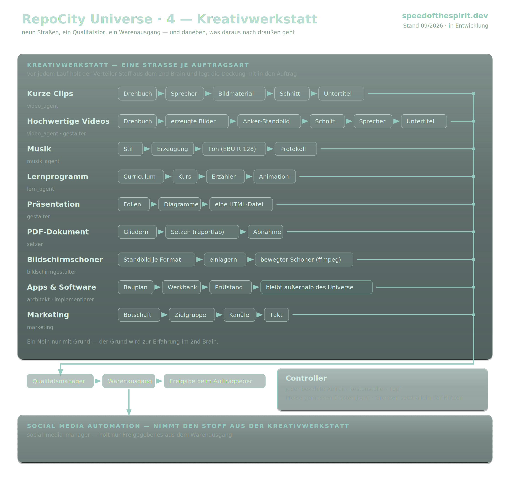

# Das Organigramm

RepoCity ist kein einzelnes Programm, sondern ein Schwarm. Jeder Agent hat eine
Zuständigkeit, einen eigenen Ordner und einen eigenen Eintrag im Verzeichnis.
Aufträge laufen nicht kreuz und quer, sondern über den Kern.

Die vier Tafeln zeigen dasselbe System aus vier Blickwinkeln.

---

## 1 · Struktur — wer gehört wozu

Die Aufteilung des Schwarms in Bereiche. Oben der Kern, darunter die Agenten,
gruppiert nach dem, wofür sie zuständig sind: Verwaltung, Werkstatt, Handel,
Betrieb.

---

## 2 · Der Weg eines Auftrags

Was zwischen der Eingabe und dem Ergebnis geschieht: Auftrag annehmen, Modell
wählen, Schritte verketten, Zwischenstand halten, Ergebnis prüfen, Erfahrung
zurückführen. Der Fehlerfall ist Teil des Weges, kein Sonderfall.

---

## 3 · Automation — was ohne Zutun läuft

Die Abläufe, die von selbst anspringen: Zeitplan, Posteingang, Marktbeobachtung,
Sicherung, Kostenbremse.

---

## 4 · Werkstatt — wo gebaut wird

Die kreative Seite: Bild, Video, Musik, Text und Schnitt — welcher Agent welches
Modell anspricht und wo das Ergebnis landet.

---

Die Tafeln sind auch in der laufenden Oberfläche zu sehen, unter
**[speedofthespirit.dev](https://speedofthespirit.dev)** → Überblick → Organigramm.
